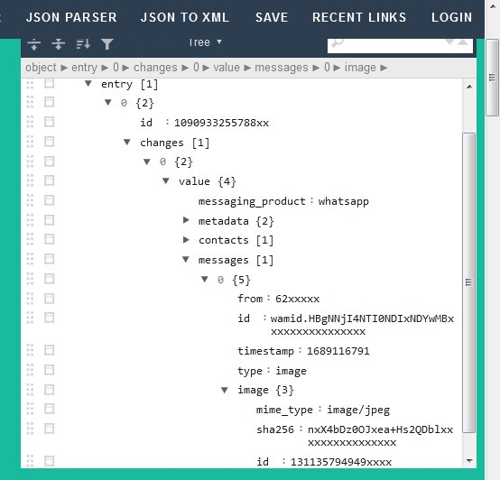

# php-download-image-dari-bot-whatsapp-meta

contoh respon webhook jika ada gambar yang diterima bot

<pre>
{"object":"whatsapp_business_account","entry":[{"id":"1090933255788xx","changes":[{"value":{"messaging_product":"whatsapp","metadata":{"display_phone_number":"628515xxxxx","phone_number_id":"10924711xxxxx"},"contacts":[{"profile":{"name":"biston"},"wa_id":"6285xxxxxx"}],"messages":[{"from":"62xxxxx","id":"wamid.HBgNNjI4NTI0NDIxNDYwMBxxxxxxxxxxxxxxxx","timestamp":"1689116791","type":"image","image":{"mime_type":"image\/jpeg","sha256":"nxX4bDz0OJxea+Hs2QDblxxxxxxxxxxxxxxxx","id":"131135794949xxxx"}}]},"field":"messages"}]}]}				
</pre>  
contoh ambil id-gambar (idd)   
$idd = $dx['entry'][0]['changes'][0]['value']['messages'][0]['image']['id']

setelah medapatkan id-gambar, lakukan proses get ke ambil.php dengan bearer akun
<pre>
http://contoh.web.id/ambil.php?id=123456&bx=aaaaaaaaabbbbbbbbccccccccccc  
</pre>
jika berhasil maka hasilnya adalah link gambarnya 
<pre>
   {"url":"http://contoh.web.id/123456.jpg"}
</pre> 
  

